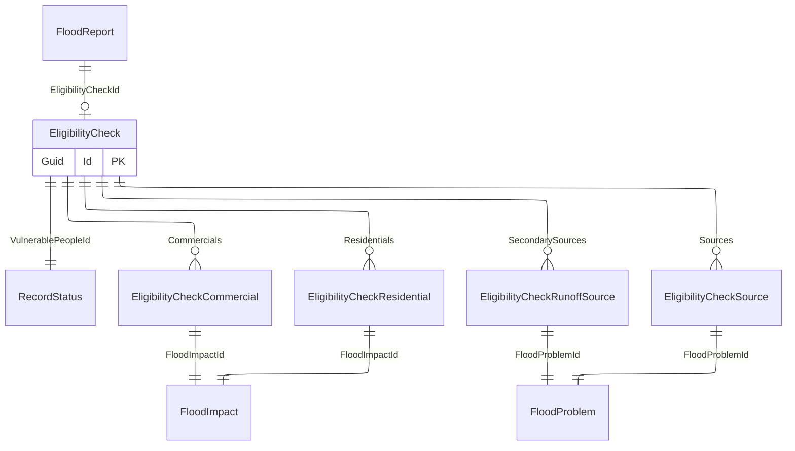

# Eligibility check

## Purpose

The EligibilityCheck represents an assessment to determine if a person qualifies for assistance, related to flood damage.
This is the information saved when someone completes the online flood report form.

## Simple relationships

## Where it is used

- [FloodReport](FloodReport.md)