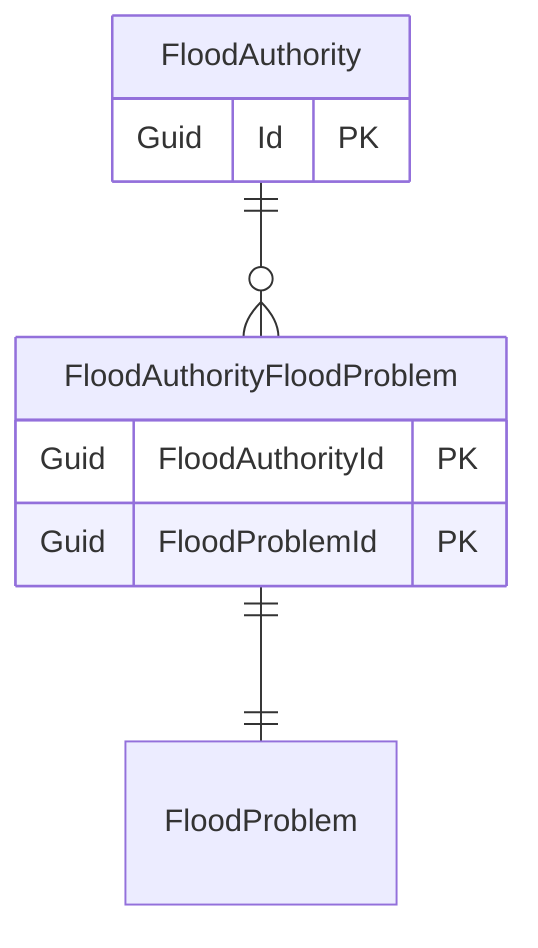

# Flood authority

## Purpose

The FloodAuthority are authorities and agencies responsible for managing, mitigating, and responding to flood risks and incidents.

## Simple relationships

## Where it is used

- [Organisation](Organisation.md)