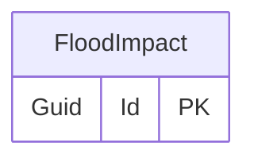

# Flood impact

## Purpose

The FloodImpact represents the broader impacts of a flood, such as health risks, economic losses, etc.

## Categories

- Commercial / Zone-C
- Community Impact
- Impact Duration
- Priority
- Property Type
- Residential / Zone-R
- Service Impact

## Priorities

- None
- Internal
- External
- Both
- Other

## Simple relationships

## Where it is used

- [EligibilityCheck](EligibilityCheck.md)