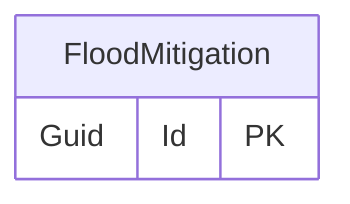

# Flood mitigation

## Purpose

The FloodMitigation are actions and measures taken to reduce or prevent the impact of flooding.

## Categories

- Action Taken
- Flood Warden Awareness
- Help Received From
- Warning Source

## Simple relationships

## Where it is used

- [Investigation](Investigation.md)