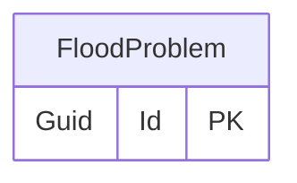

# Flood problem

## Purpose

The FloodProblem represents specific problems caused by a flood, such as structural damage, water contamination, etc.

## Categories

- Appearance
- Duration
- Primary Cause
- Secondary Cause
- Water Destination
- Water Entry
- Water Onset
- Water Speed

## Simple relationships

## Where it is used

- [EligiblityCheck](EligiblityCheck.md)
- [FloodAuthority](FloodAuthority.md)
- [Investigation](Investigation.md)