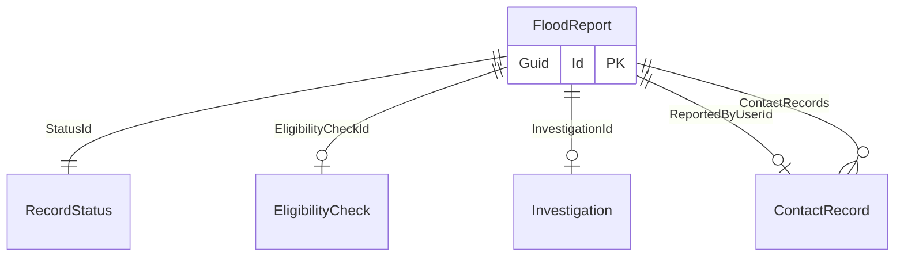

# Flood report

## Purpose

The FloodReport represents an overview of a flood event reported by a user.
It captures essential information about the flood within the EligibilityCheck, as well as its status, any investigation, and contact records.

## Simple relationships

