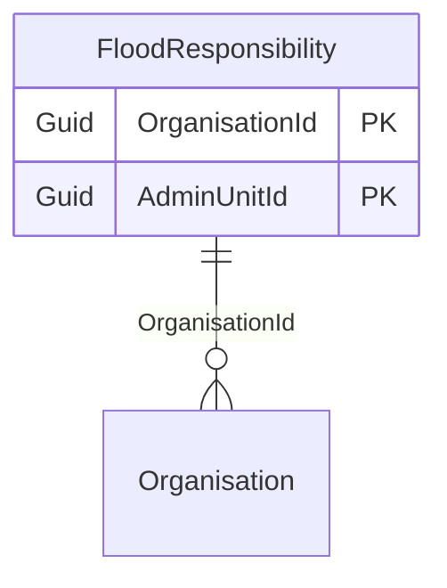
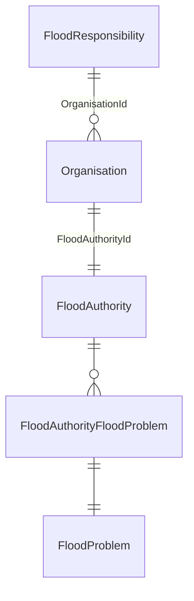

# Flood responsibility

## Purpose

The FloodResponsibility represents the association between organisations and administrative units for flood management. It defines which organisations are responsible for flood-related activities within specific administrative areas.

CommonRepository > GetResponsibleOrganisations() reads the boundaries database and then uses FloodResponsibility to determine which organisations are responsible for flood management in the affected areas.

## Simple relationships

## Relationships overview

## Where it is used

- CommonRepository > GetResponsibleOrganisations()