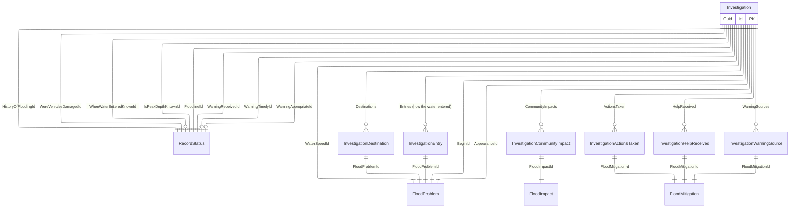

# Investigation

## Purpose

The Investigation represents investigations carried out by the relevant authority, for example grants.

## Simple relationships

## Where it is used

- [FloodReport](FloodReport.md)