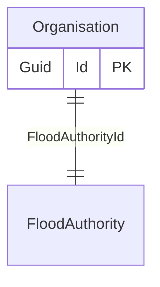

# Organisation

## Purpose

Represents an Organisation that receives or manages flood reports (for example: local authorities, the Environment Agency) and stores details of the organisation including, website, data protection statement, and associated FloodAuthority.

## Simple relationships

## Where it is used

- [FloodResponsibility](FloodResponsibility.md)
- EligibilityResult created when calculating the eligibility using EligibilityCheckRepository