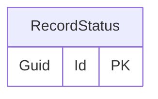

# Record status

## Purpose

The RecordStatus provides the possible answers or states for many fields in the system, such as yes/no options, the stage of a process, or the status of a report. It is used to capture responses, progress, or conditions for things like eligibility checks, flood reports, and investigations.

## Categories

- Area Flood Status
- Data Protection
- Flood report status
- General
- Phase / Area
- Validation
- Section19 Status

## Simple relationships

## Where it is used

- [EligibilityCheck](EligibilityCheck.md)
- [FloodReport](FloodReport.md)
- [Investigation](Investigation.md)