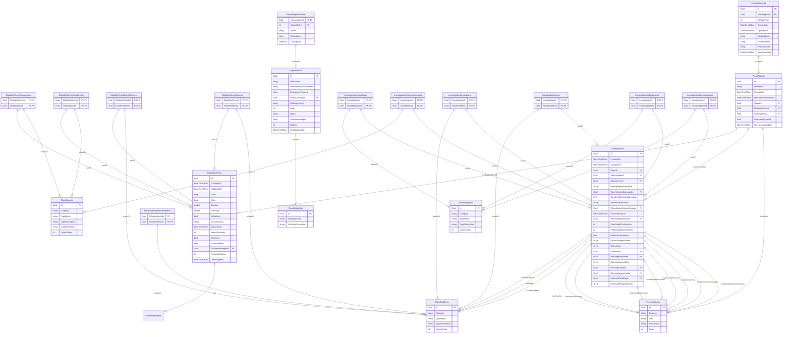
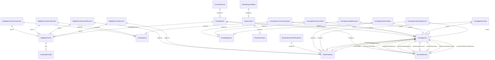

# Table and Relationship Diagrams

## Full relationship diagrams

```mermaid
erDiagram
ContactRecords {
    Guid Id PK
    Guid FloodReportId FK
    int ContactType
    DateTimeOffset CreatedUtc
    DateTimeOffset UpdatedUtc
    string ContactName
    string EmailAddress
    string PhoneNumber
    DateTimeOffset RedactionDate
}

EligibilityCheckCommercials {
    Guid EligibilityCheckId PK, FK
    Guid FloodImpactId PK, FK
}

EligibilityCheckResidentials {
    Guid EligibilityCheckId PK, FK
    Guid FloodImpactId PK, FK
}

EligibilityCheckRunoffSources {
    Guid EligibilityCheckId PK, FK
    Guid FloodProblemId PK, FK
}

EligibilityCheckSources {
    Guid EligibilityCheckId PK, FK
    Guid FloodProblemId PK, FK
}

EligibilityChecks {
    Guid Id PK
    DateTimeOffset CreatedUtc
    DateTimeOffset UpdatedUtc
    long Uprn
    long Usrn
    double Easting
    double Northing
    bool IsAddress
    string LocationDesc
    DateTimeOffset ImpactStart
    int ImpactDuration
    bool OnGoing
    bool Uninhabitable
    Guid VulnerablePeopleId FK
    int VulnerableCount
    DateTimeOffset TermsAgreed
}

FloodAuthorities {
    Guid Id PK
    string AuthorityName
    string AuthorityDescription
}

FloodAuthorityFloodProblems {
    Guid FloodAuthorityId PK
    Guid FloodProblemId PK, FK
}

FloodImpacts {
    Guid Id PK
    string Category
    string TypeName
    string TypeDescription
    string CategoryPriority
    int OptionOrder
}

FloodMitigations {
    Guid Id PK
    string Category
    string TypeName
    string TypeDescription
    int OptionOrder
}

FloodProblems {
    Guid Id PK
    string Category
    string TypeName
    string TypeDescription
    int OptionOrder
}

FloodReports {
    Guid Id PK
    string Reference
    DateTimeOffset CreatedUtc 
    DateTimeOffset MarkedForDeletionUtc
    Guid StatusId FK
    Guid EligibilityCheckId FK
    Guid InvestigationId FK
    Guid ReportedByUserId
    DateTimeOffset UserAccessUntilUtc
}

FloodResponsibilites {
    Guid OrganisationId PK, FK
    int AdminUnitId PK
    string Name
    string Description
    DateOnly LookupDate
}

InvestigationActionsTaken {
    Guid InvestigationId PK, FK
    Guid FloodMitigationId PK, FK
}

InvestigationCommunityImpact {
    Guid InvestigationId PK, FK
    Guid FloodImpactId PK, FK
}

InvestigationDestinations {
    Guid InvestigationId PK, FK
    Guid FloodProblemId PK, FK
}

InvestigationEntries {
    Guid InvestigationId PK, FK
    Guid FloodProblemId PK, FK
}

InvestigationHelpReceived {
    Guid InvestigationId PK, FK
    Guid FloodMitigationId PK, FK
}

InvestigationWarningSources {
    Guid InvestigationId PK, FK
    Guid FloodMitigationId PK, FK
}

Investigations {
    Guid Id PK
    DateTimeOffset CreatedUtc
    DateTimeOffset UpdatedUtc
    Guid BeginId FK
    Guid WaterSpeedId FK
    Guid AppearanceId FK
    string MoreAppearanceDetails
    Guid WereVehiclesDamagedId FK
    byte NumberOfVehiclesDamaged
    string WaterEnteredOther
    Guid WhenWaterEnteredKnownId FK
    DateTimeOffset FloodInternalUtc
    Guid IsPeakDepthKnownId FK
    int PeakInsideCentimetres
    int PeakOutsideCentimetres
    bool HasKnownProblems
    string KnownProblemDetails
    string OtherAction
    Guid FloodlineId FK
    Guid WarningReceivedId FK
    string WarningSourceOther
    Guid WarningTimelyId FK
    Guid WarningAppropriateId FK
    Guid HistoryOfFloodingId FK
    string HistoryOfFloodingDetails
}

Organisations {
    Guid Id PK
    string Description
    string DataProtectionStatement
    string EmergencyPlanning
    Guid FloodAuthorityId FK
    string GettingInTouch
    Uri Logo
    string Name
    string SubmissionReply
    Uri Website
    DateTimeOffset LastUpdatedUtc
}

RecordStatuses {
    Guid Id PK
    string Category
    string Text
    string Description
    int Order
}

ContactRecords ||--o| FloodReports : belongsTo

EligibilityCheckCommercials ||--|{ EligibilityChecks : partOf
EligibilityCheckCommercials ||--|{ FloodImpacts : relatesTo

EligibilityCheckResidentials ||--|{ EligibilityChecks : partOf
EligibilityCheckResidentials ||--|{ FloodImpacts : relatesTo

EligibilityCheckRunoffSources ||--|{ EligibilityChecks : partOf
EligibilityCheckRunoffSources ||--|{ FloodProblems : relatesTo

EligibilityCheckSources ||--|{ EligibilityChecks : partOf
EligibilityCheckSources ||--|{ FloodProblems : relatesTo

EligibilityChecks ||--o| VulnerablePeople : has

FloodAuthorityFloodProblems ||--|{ FloodProblems : relatesTo

FloodReports ||--o| EligibilityChecks : hasEligibilityCheck
FloodReports ||--o| Investigations : hasInvestigation
FloodReports ||--o| RecordStatuses : hasStatus

FloodResponsibilites ||--o| Organisations : belongsTo

InvestigationActionsTaken ||--|{ FloodMitigations : relatesTo
InvestigationActionsTaken ||--|{ Investigations : partOf

InvestigationCommunityImpact ||--|{ FloodImpacts : relatesTo
InvestigationCommunityImpact ||--|{ Investigations : partOf

InvestigationDestinations ||--|{ FloodProblems : relatesTo
InvestigationDestinations ||--|{ Investigations : partOf

InvestigationEntries ||--|{ FloodProblems : relatesTo
InvestigationEntries ||--|{ Investigations : partOf

InvestigationHelpReceived ||--|{ FloodMitigations : relatesTo
InvestigationHelpReceived ||--|{ Investigations : partOf

InvestigationWarningSources ||--|{ FloodMitigations : relatesTo
InvestigationWarningSources ||--|{ Investigations : partOf

Investigations ||--o| FloodProblems : hasAppearance
Investigations ||--o| FloodProblems : hasBegin
Investigations ||--o| FloodProblems : hasWaterSpeed
Investigations ||--o| RecordStatuses : hasFloodline
Investigations ||--o| RecordStatuses : hasHistoryOfFlooding
Investigations ||--o| RecordStatuses : hasIsPeakDepthKnown
Investigations ||--o| RecordStatuses : hasWarningAppropriate
Investigations ||--o| RecordStatuses : hasWarningReceived
Investigations ||--o| RecordStatuses : hasWarningTimely
Investigations ||--o| RecordStatuses : hasWereVehiclesDamaged
Investigations ||--o| RecordStatuses : hasWhenWaterEnteredKnown

Organisations ||--o| FloodAuthorities : isPartOf

```

## Simple relationship diagrams

```mermaid
erDiagram

ContactRecords ||--o| FloodReports : belongsTo

EligibilityCheckCommercials ||--|{ EligibilityChecks : partOf
EligibilityCheckCommercials ||--|{ FloodImpacts : relatesTo

EligibilityCheckResidentials ||--|{ EligibilityChecks : partOf
EligibilityCheckResidentials ||--|{ FloodImpacts : relatesTo

EligibilityCheckRunoffSources ||--|{ EligibilityChecks : partOf
EligibilityCheckRunoffSources ||--|{ FloodProblems : relatesTo

EligibilityCheckSources ||--|{ EligibilityChecks : partOf
EligibilityCheckSources ||--|{ FloodProblems : relatesTo

EligibilityChecks ||--o| VulnerablePeople : has

FloodAuthorityFloodProblems ||--|{ FloodProblems : relatesTo

FloodReports ||--o| EligibilityChecks : hasEligibilityCheck
FloodReports ||--o| Investigations : hasInvestigation
FloodReports ||--o| RecordStatuses : hasStatus

FloodResponsibilites ||--o| Organisations : belongsTo

InvestigationActionsTaken ||--|{ FloodMitigations : relatesTo
InvestigationActionsTaken ||--|{ Investigations : partOf

InvestigationCommunityImpact ||--|{ FloodImpacts : relatesTo
InvestigationCommunityImpact ||--|{ Investigations : partOf

InvestigationDestinations ||--|{ FloodProblems : relatesTo
InvestigationDestinations ||--|{ Investigations : partOf

InvestigationEntries ||--|{ FloodProblems : relatesTo
InvestigationEntries ||--|{ Investigations : partOf

InvestigationHelpReceived ||--|{ FloodMitigations : relatesTo
InvestigationHelpReceived ||--|{ Investigations : partOf

InvestigationWarningSources ||--|{ FloodMitigations : relatesTo
InvestigationWarningSources ||--|{ Investigations : partOf

Investigations ||--o| FloodProblems : hasAppearance
Investigations ||--o| FloodProblems : hasBegin
Investigations ||--o| FloodProblems : hasWaterSpeed
Investigations ||--o| RecordStatuses : hasFloodline
Investigations ||--o| RecordStatuses : hasHistoryOfFlooding
Investigations ||--o| RecordStatuses : hasIsPeakDepthKnown
Investigations ||--o| RecordStatuses : hasWarningAppropriate
Investigations ||--o| RecordStatuses : hasWarningReceived
Investigations ||--o| RecordStatuses : hasWarningTimely
Investigations ||--o| RecordStatuses : hasWereVehiclesDamaged
Investigations ||--o| RecordStatuses : hasWhenWaterEnteredKnown

Organisations ||--o| FloodAuthorities : isPartOf

```