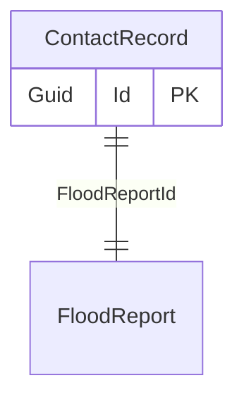

# Contact record

## Purpose

The ContactRecord is to allow us to keep in touch with a an actual person.
And in some specific cases allow the user to provide us additional information, or edit some of the flood report details.

Where possible we should avoid duplicating information.

Given that contact records can be created by the public and on behalf of others, we must ensure emails are verified.

## Types of contact records

There are different types of contact records, each serving a specific purpose:
- Tenant
- Home Owner
- Non Resident

## Simple relationships

## Where it is used

- [FloodReport](FloodReport.md)