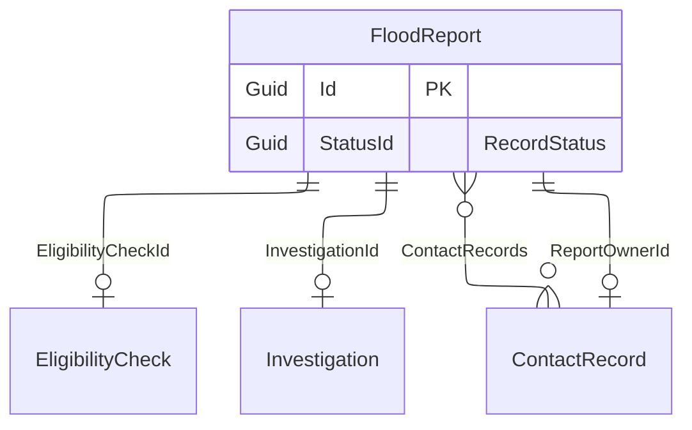

# Flood report

## Purpose

The FloodReport represents an overview of a flood event reported by a user.
It captures essential information about the flood within the EligibilityCheck, as well as its status, any investigation, and contact records.

Each FloodReport should have a report owner, represented by the ReportOwnerId. This may be:
- null = this is an anonymous record
- a user = indicating the record can be edited and further information can be requested
- a contact only = meaning you can potentially reach out to them for more information but no editing rights are granted.

## Status
The StatusId field indicates the current status of the flood report.
It uses the RecordStatus entity to capture responses of:
- Marked for deletion
- New
- Viewed
- Action needed
- Action completed
- Error

## Simple relationships

