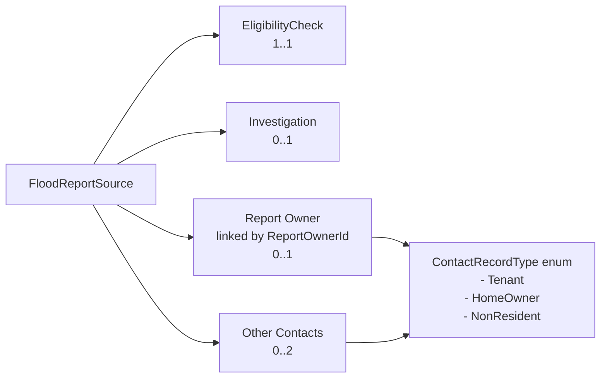

# Flood Report Source Relationships

## Overview

Please use [Glossary of Terms](Glossary.md) for definitions of the main terms used in this application.

## Relationships

## Relationship Summary

A flood report source can link to:
- one **Eligibility Check**
- zero or one **Investigation**
- zero or one **Report Owner**
- zero to two **Other Contacts**

The contacts associated with a record are drawn from the available contact types and help define who reported the event and who may be contacted later.