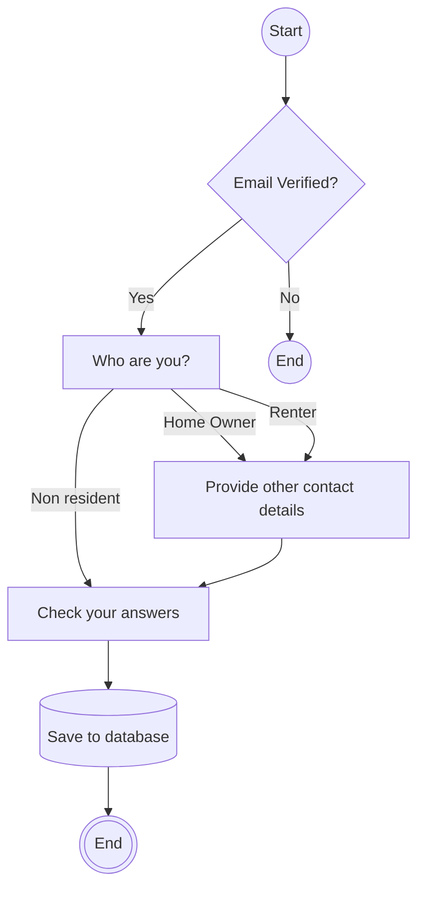

## Contact Details Flow

At this point the user will be subscribed or logged in.

- Users can optionally provide phone contacts on the who are you page.
- They will also have the name and email prefilled from earlier in the process.