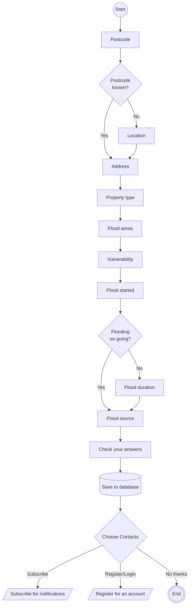

# Flow diagram for creating a flood report

## After creating a flood report
- The user can optionally choose to subscribe to notifications or more.
- See the following for more details:
    - [Subscribing for notifications flow](subscribing_for_notifications.md)
    - [Registration flow](registration.md)