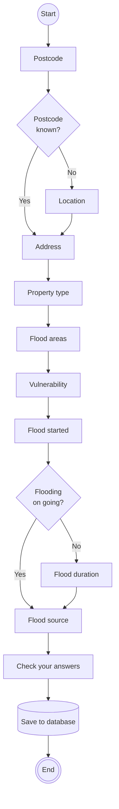
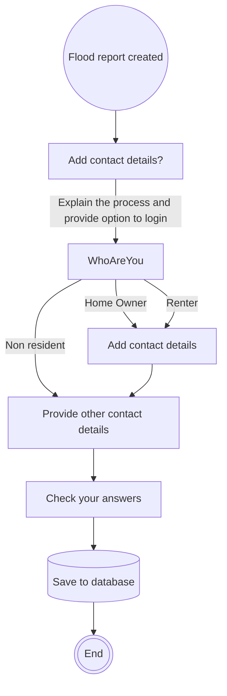

# Flow diagram for creating a flood report

## After creating a flood report
The user can choose to add contact details as:
 - an anonymous reporter (do nothing - report remains anonymous)
 - just providing the contact details
 - a logged in user

The flow for adding contact details is described below

