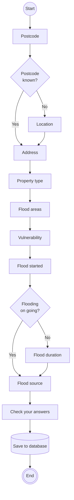

# Flow diagram for creating a flood report

## After creating a flood report
The user can optionally choose to subscribe to notifications or more.
See [subscribing for notifications](subscribing_for_notifications.md) for more details.