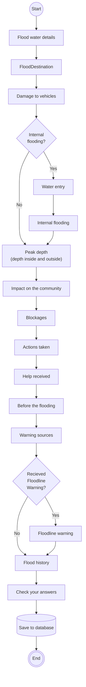

# Flow diagram for creating an investigation

Only show an investigation page when:
- Signed in
- No investigation exists
- Flood report `Status` is `Action Needed`

## Signed in
Signed in is currently when a flood reference is present.

This design is changing and is being updated to a more standard authentication process.

## Internal flooding
The logic to determine if a flood is internal is handled by ```EligibilityCheck.IsInternal()```.

## Flow diagram


