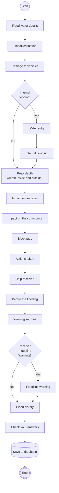

# Flow diagram for creating an investigation

Only show an investigation page when:
- Signed in
- No investigation exists
- Flood report source `Status` is `Action Needed`

## Signed in
To sign in the user will need an account with Microsoft External ID or another suitable OpenID Connect provider. 

## Internal flooding
The logic to determine if a flood is internal is handled by ```EligibilityCheck.IsInternal``` extension property.

## Flow diagram


```mermaid
flowchart TB
    Index((Start)) --> Speed[Flood water details]
    Speed --> FloodDestination
    FloodDestination --> Vehicles[Damage to vehicles]
    Vehicles --> IsInternalFlooding{Internal<br>flooding?}
    IsInternalFlooding -- No --> PeakDepth["Peak depth<br>(depth inside and outside)"]
    IsInternalFlooding -- Yes --> Entry["Water entry"]
    Entry --> InternalWhen["Internal flooding"]
    InternalWhen --> PeakDepth
    PeakDepth --> ServiceImpact[Impact on services]
    ServiceImpact --> CommunityImpact[Impact on the community]
    CommunityImpact --> Blockages
    Blockages --> ActionsTaken[Actions taken]
    ActionsTaken --> HelpReceived[Help received]
    HelpReceived --> Warnings[Before the flooding]
    Warnings --> WarningSources[Warning sources]
    WarningSources --> WarningSourceContainsFloodline{Received<br>Floodline<br>Warning?}
    WarningSourceContainsFloodline -- No --> History[Flood history]
    WarningSourceContainsFloodline -- Yes --> Floodline[Floodline warning]
    Floodline --> History
    History --> Summary[Check your answers]
    Summary --> Save[(Save to database)]
    Save --> Confirmation((( End )))
```
