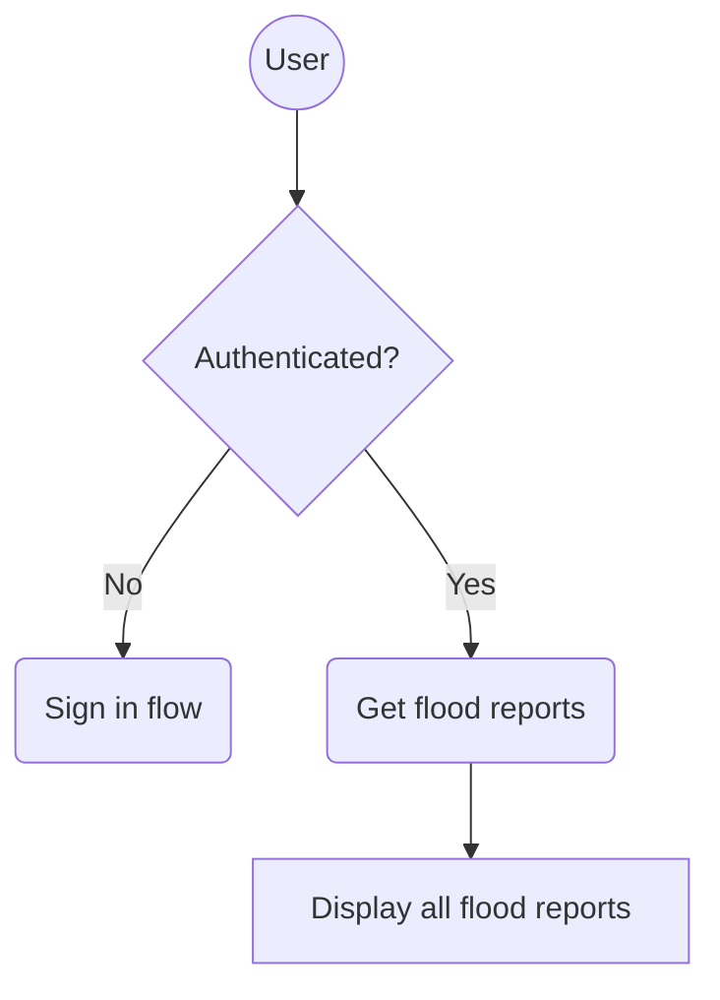
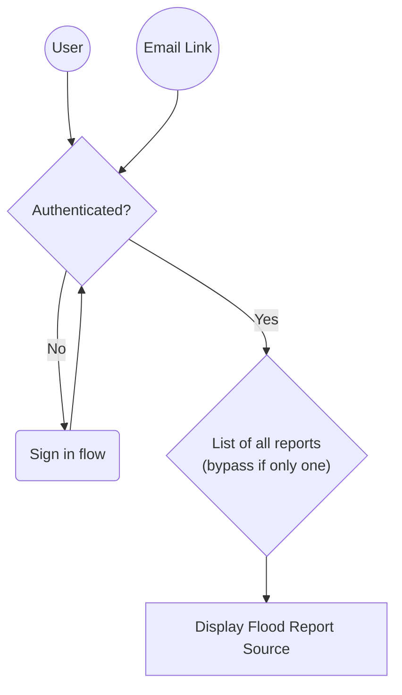

# Overview flow

## All flood reports page

Note: This application creates flood report sources but the users will see a `source` referred to a `flood report` because this is their flood report. 

The flood risk managers will be using the `single version of the truth` model where different reports of the same flooding are grouped so this introduces a terminology clash. 

We have used `flood report source` in the codebase but the will still use `flood report` in the UI to avoid confusion for end users.

## Manage flood report sources page

