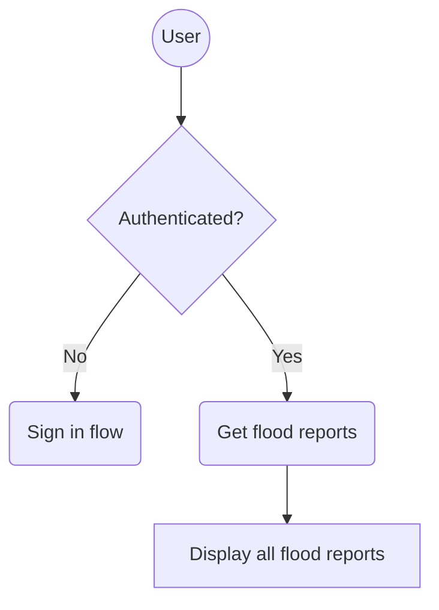
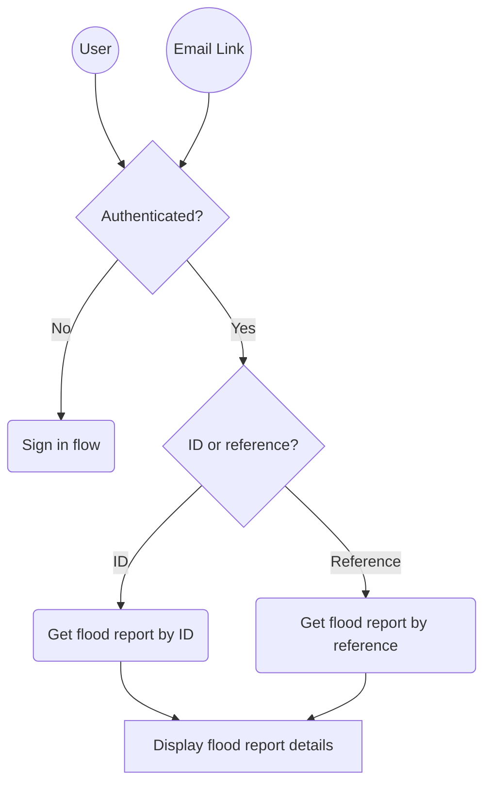

# Overview flow

## All flood reports page

```mermaid
flowchart TD
    User(("User")) --> Authenticated{"Authenticated?"}
    Authenticated -->|No| SignInFlow("Sign in flow")
    Authenticated -->|Yes| GetData("Get flood reports")
    GetData --> DisplayFloodReports["Display all flood reports"]
```

## Single flood report page

```mermaid
flowchart TD
    User(("User")) --> Authenticated{"Authenticated?"}
    EmailLink(("Email Link")) --> Authenticated
    Authenticated -->|No| SignInFlow("Sign in flow")
    Authenticated -->|Yes| IdOrReference{"ID or reference?"}
    IdOrReference -->|ID| GetDataById("Get flood report by ID")
    IdOrReference -->|Reference| GetDataByReference("Get flood report by reference")
    GetDataById --> DisplayFloodReport["Display flood report details"]
    GetDataByReference --> DisplayFloodReport
```
