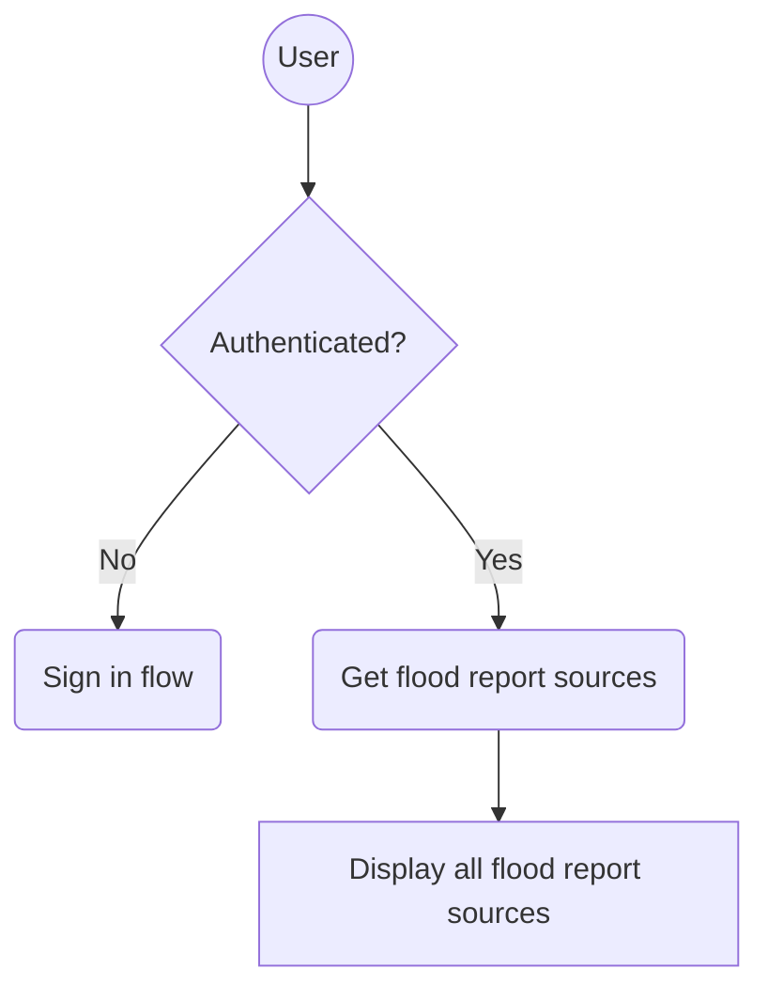
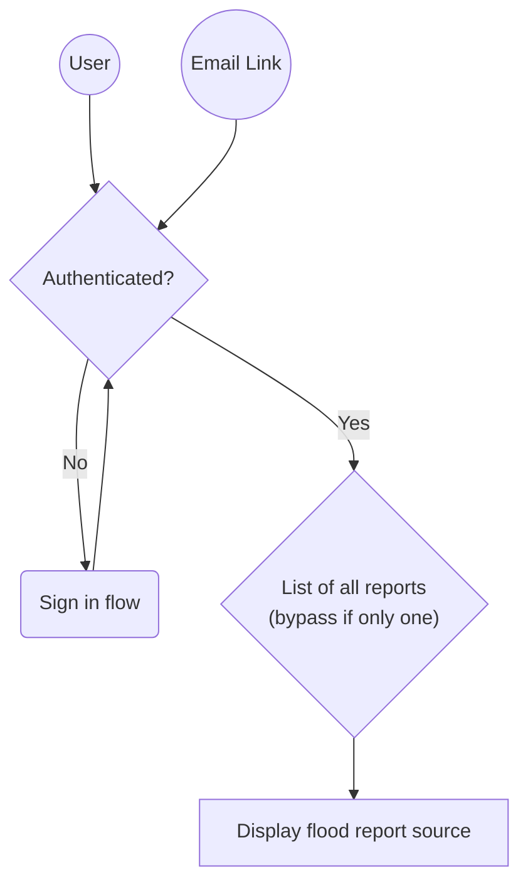

# Overview flow

## All flood report sources page

Note: This application creates flood report sources, but users will see a `flood report source` referred to as a `flood report` because that is how they understand their report.

Flood risk managers use the `single version of the truth` model, where different reports of the same flooding are grouped together, so this introduces a terminology clash.

We use `flood report source` in the codebase, but we still use `flood report` in the UI to avoid confusion for end users.

## Manage flood report sources page

