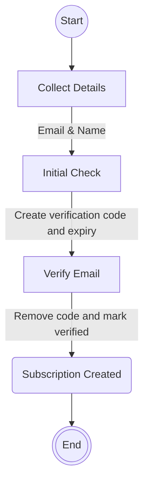

## Notifications flow

After reporting flooding we encourage users to subscribe to notifications about their report. 
They can choose two routes:
- Subscribe to recieve notification emails only
- Register for an account to allow them to login and manage the current (and other linked) record and recieve notification emails

See [registration](registration.md) for details on the registration flow.

## Subscription flow

## Verfication email
Gov.Notify template email will send the user a URL containing the versification endpoint and code.

## Post subscription
After submitting the subscription form, users are directed to the [contact flow](contact_flow.md).