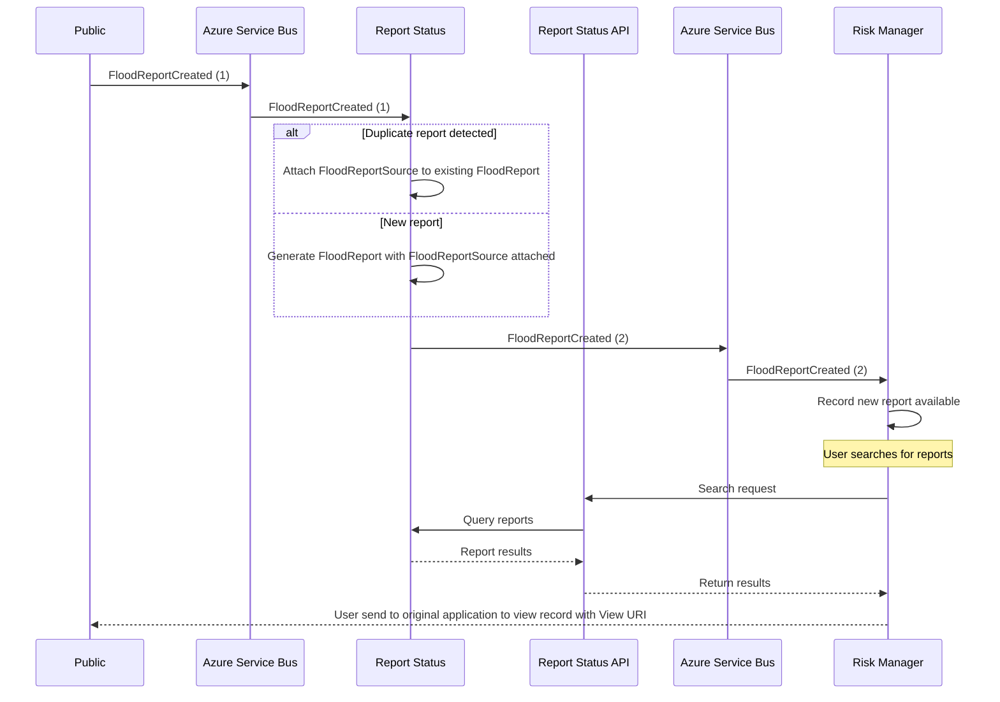

```mermaid
sequenceDiagram
    participant Public
    participant ASB as Azure Service Bus
    participant RS as Report Status
    participant RSA as Report Status API
    participant ASB2 as Azure Service Bus
    participant RM as Risk Manager

    Public->>ASB: FloodReportCreated (1)

    ASB->>RS: FloodReportCreated (1)

    alt Duplicate report detected
        RS->>RS: Attach FloodReportSource to existing FloodReport
    else New report
        RS->>RS: Generate FloodReport with FloodReportSource attached
    end

    RS->>ASB2: FloodReportCreated (2)

    ASB2->>RM: FloodReportCreated (2)
    RM->>RM: Record new report available

    Note over RM: User searches for reports

    RM->>RSA: Search request
    RSA->>RS: Query reports
    RS-->>RSA: Report results
    RSA-->>RM: Return results

    RM-->>Public: User send to original application to view record with View URI
```