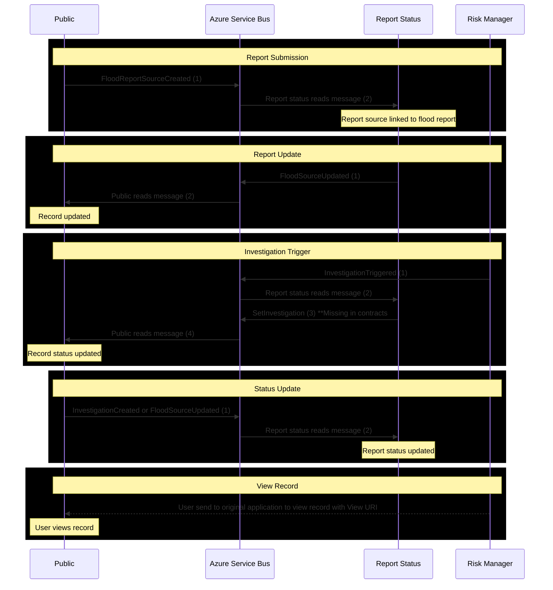

```mermaid
sequenceDiagram
    participant Public
    participant ASB as Azure Service Bus
    participant RS as Report Status
    participant RM as Risk Manager
    

    rect rgb(0, 0, 0)
        Note over Public,RM: Report Submission
        Public->>ASB: FloodReportSourceCreated (1)
        ASB->>RS: Report status reads message (2)
        Note over RS: Report source linked to flood report
    end

    rect rgb(0, 0, 0)
        Note over Public,RM: Report Update
        RS->>ASB: FloodSourceUpdated (1)
        ASB->>Public: Public reads message (2)
        Note over Public: Record updated
    end

    rect rgb(0, 0, 0)
        Note over Public,RM: Investigation Trigger
        RM->>ASB: InvestigationTriggered (1)
        ASB->>RS: Report status reads message (2)
        RS->>ASB: SetInvestigation (3) **Missing in contracts
        ASB->>Public: Public reads message (4)
        Note over Public: Record status updated
    end

    rect rgb(0, 0, 0)
        Note over Public,RM: Status Update
        Public->>ASB: InvestigationCreated or FloodSourceUpdated (1)
        ASB->>RS: Report status reads message (2)
        Note over RS: Report status updated
    end


    rect rgb(0, 0, 0)
        Note over Public,RM: View Record
        RM-->>Public: User send to original application to view record with View URI
        Note over Public: User views record
    end
```