```mermaid
sequenceDiagram
    participant L as 
    participant Public
    participant ASB as Azure Service Bus
    participant RS as Report Status
    participant RM as Risk Manager
    participant R as 
    

    rect rgb(0, 0, 0)
        Note over L,R: Report Submission
        Public->>ASB: FloodReportSourceCreated (1)
        ASB->>RS: Report status reads message (2)
        Note over RS: Report source linked to flood report
    end

    rect rgb(0, 0, 0)
        Note over L,R: Report Update
        RS->>ASB: FloodSourceUpdated (1)
        ASB->>Public: Public reads message (2)
        Note over Public: Record updated
    end

    rect rgb(0, 0, 0)
        Note over L,R: Investigation Trigger
        RM->>ASB: InvestigationTriggered (1)
        ASB->>RS: Report status reads message (2)
        RS->>ASB: SetInvestigation (3) **Missing in contracts
        ASB->>Public: Public reads message (4)
        Note over Public: Record status updated
    end

    rect rgb(0, 0, 0)
        Note over L,R: Status Update
        Public->>ASB: InvestigationCreated or FloodSourceUpdated (1)
        ASB->>RS: Report status reads message (2)
        Note over RS: Report status updated
    end


    rect rgb(0, 0, 0)
        Note over L,R: View Record
        RM-->>Public: Users sent to original application to view record with View URI
        Note over Public: User views record
    end
```

- We may need to update this so that there is an API allowing users to view the record in the calling application (such as Risk Management module) instead of being sent to the original application but this would introduce data sharing complexities and may be difficult if the user is not using this public module. They may be using something else instead. 
- Other communications may exist; this flow diagram is just to give an idea of some of the most important communications that occur between the public module, report status, and risk manager.
